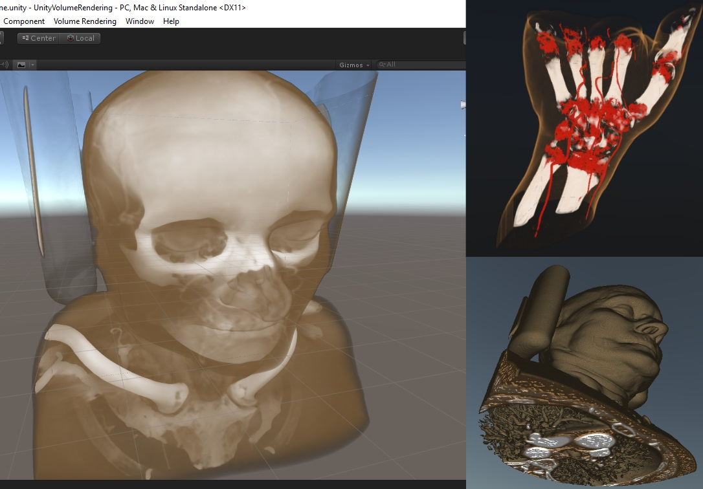
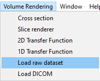
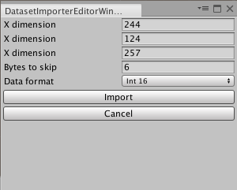
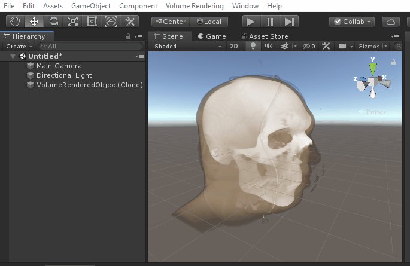
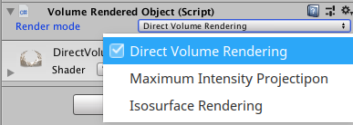
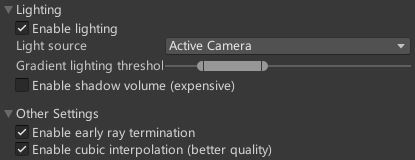
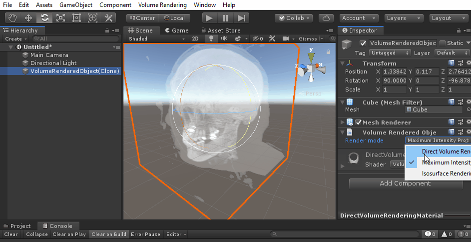

# UnityVolumeRendering

A volume renderer, made in Unity3D.

# Table of contents

This Readme contains a quick introduction to the library. For more info, see the [complete documentation](Documentation/Documentation.md).

- [Requirements](#requirements)
- [How to use sample scene](#how-to-use-sample-scene)
- [Step-by-step instructions](#step-by-step-instructions)
- [Direct Volume Rendering](#direct-volume-rendering)
- [Isosurface Rendering](#isosurface-rendering)
- [Importing DICOM and NRRD](#importing-dicom-and-nrrd)
- [How to use in your own project](#how-to-use-in-your-own-project)

# Requirements

- Unity 2018 1.5 or newer (should also work with some older versions, but I haven't tested)

# How to use sample scene

- Open "TestScene.unity"
- Click "Volume Rendering" in the menu bar
- Select "Load Raw dataset" (or something else, if you already have a dataset you want to import)
- Pick a file in the "DataFiles" folder (I recommend VisMale.raw)
- Click the "import"-button

# Step-by-step instructions

**1. Import model**

**Raw datasets:**

In the menu bar, click "Volume Rendering" and "Load raw dataset"

Then select the dataset you wish to import..

In the next menu you can optionally set the import setting for the raw dataset. For the sample files you don't need to change anything.

**DICOM:**

To import a DICOM dataset, click "Volume Rendering" and "Load DICOM" and select the folder containing your DICOM files.
The dataset must be of 3D nature, and contain several files - each being a slice along the Z axis.

**2. Moving the model**

You can move the model like any other GameObject. Simply select it in the scene view or scene hierarchy, and move/rotate it like normal.

**3. Changing the visualisation**

Select the model and find the "Volume Render Object" in the inspector.

Here you can change the "Render mode":

Example:

There are 3 render modes:

- Direct Volume Rendering (using transfer functions)
- Maximum Intensity Projection (shows the maximum density)
- Isosurface Rendering

There are also some other settings that you can adjust:

- "Enable lighting": Enable lighting calculations during volume rendering.
- "Enable shadow volume": Expensive, but may look much better!
- Enable early ray termination: Optimisation (you usually want this on). Requires the above setting to be disabled.
- Enable cubic interpolation: Use cubic interpolation of the 3D volume texture and gradient texture.

****

# Direct Volume Rendering

Direct volume rendering is the most standard rendering mode. It sends rays through the dataset, and uses "transfer functions" (1D or 2D) to determine the colour and opacity. Transfer functions map density (2D: also gradient magnitude) to a colour and opacity.

- **Modifying transfer functions**: Click "Volume Rendering" in the menu bar and select "1D Transfer Function" or "2D Transfer Function"
  - **1D Transfer Function**: X-axis represents density and Y-axis represents alpha (opaccity). Move the grey alpha knots to create a curve for opacity by density. Right-click to add new alpha knots. The bottom gradient-coloured panel maps colour to density. Right-click to add new knots and click on an existing colour knot to modify its colour.
  - **2D Transfer Function**: X-axis represents density and Y-axis represents gradient magnitude. Click "add rectangle" to add a new rectangle-shape. Move the four sliders (bottom left) to modify size/position. Modify the two sliders to the right to change min/max alpha/opacity. Each rectangle can have one colour (see colour picker).

# Isosurface Rendering

Isosurface rendering draws the first thing the ray hits, with a density higher than some threshold. You can set this threshold yourself, by selecting the object and changing the "Visible value range" in the inspector.
These can also be used with direct volume rendering mode.

# Importing DICOM and NRRD

If you're on Windows or Linux, I recommend [enabling the SimpleITK importer](Documentation/SimpleITK/SimpleITK.md), which is a requirement for JPEG2000 compressed DICOM and NRRD.

# How to use in your own project

- Create an instance of an importer (Directly, or indirectly using the `ImporterFactory`): 
`IImageFileImporter importer = ImporterFactory.CreateImageFileImporter(ImageFileFormat.NRRD);`
- Call the Import()-function, which returns a Dataset: 
`VolumeDataset dataset = importer.Import(file);`
- Use _VolumeObjectFactory_ to create an object from the dataset: 
`VolumeRenderedObject obj = VolumeObjectFactory.CreateObject(dataset);`

See the [importer documentation](Documentation/Scripting/Importing.md) for more detailed information.

## Can I use WebGL?

Yes! But keep in mind that memory will be limited, so you might not be able to load very large datasets.

I recommend that you [enable ALLOW_MEMORY_GROWTH](https://github.com/mlavik1/UnityVolumeRendering/issues/125#issuecomment-1307765842). See [#125](https://github.com/mlavik1/UnityVolumeRendering/issues/125) for more info.

Also, since WebGL builds do not have access to your local filesystem, you will not be able to upload files directly (using the runtime GUI in the sample scene, etc.). You can either:

- Import the dataset in the editor, save the scene, and create a build with the scene containing the already imported dataset.
- Create prefabs for all the datasets you want, and make a build where you spawn these on demand.
- Use [UnityWebRequest](https://docs.unity3d.com/ScriptReference/Networking.UnityWebRequest.html) to download the files from somewhere.

## Is this project free to use?

Yes, it's free even for commercial projects. The license ([MIT](https://choosealicense.com/licenses/mit/)) only requires attribution and a copyright/license notice.

## How can I make it look better?

- Try [enabling cubic sampling](https://github.com/mlavik1/UnityVolumeRendering/pull/121#issuecomment-1281289885) in the inspector.
- Try [enabling shadow volumes](Documentation/General/VolumeRendering/ShadowVolumes.md) in the inspector.
- Try increasing the value of "MAX_NUM_STEPS" in the [DirectVolumeRenderingShader.shader](https://github.com/mlavik1/UnityVolumeRendering/blob/master/Assets/Shaders/DirectVolumeRenderingShader.shader)

## How can I get better rendering performance with lighting enabled?

If you're on a platform that supports it (Windows, etc.), try [enabling DLSS (HDRP)](https://docs.unity3d.com/Packages/com.unity.render-pipelines.high-definition@12.0/manual/deep-learning-super-sampling-in-hdrp.html) or [FidelityFX Super Resolution (URP)](https://forum.unity.com/threads/amd-fidelityfx-super-resolution-fsr-preview-now-available.1141495/) and reduce the render scale.

## How can I raycast the scene to find an intersection?

- See the [VolumeRaycasting documentation](Documentation/Scripting/VolumeRaycasting.md).

## I'm stuck! How can I get help?

[Create an issue](https://github.com/mlavik1/UnityVolumeRendering/issues).
You can also reach me on [the fediverse](https://nattomaki.social/@matias).
